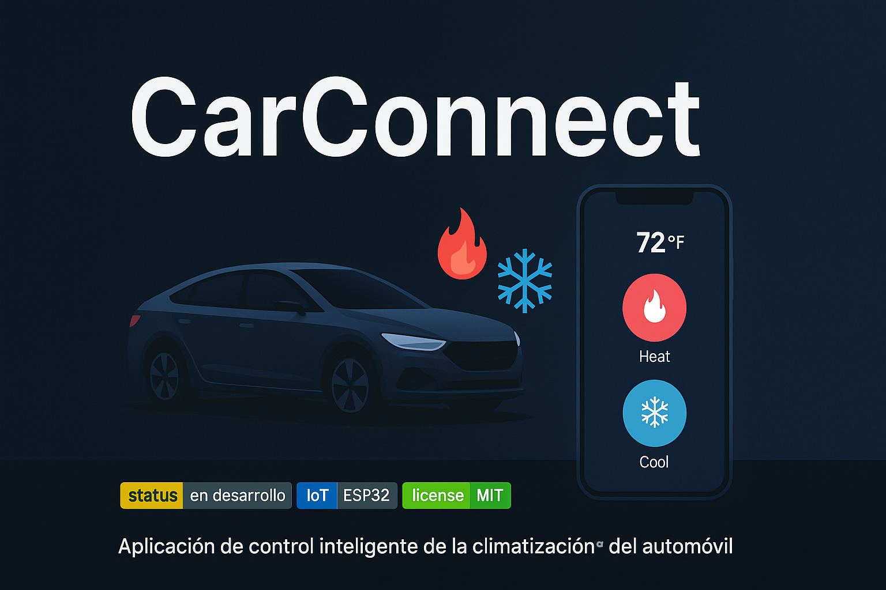

# CarConnect 🚗🔥❄️  
Aplicación inteligente para la climatización del automóvil

---

**CarConnect** es una solución innovadora que permite controlar la climatización del vehículo de forma remota desde el móvil. Diseñado para mejorar la comodidad y la calidad de vida de los conductores, este sistema permite encender la calefacción o el aire acondicionado sin necesidad de estar dentro del coche.

---

## 🌡️ ¿Por qué CarConnect?

Todos hemos sufrido al regresar al coche en un día caluroso o extremadamente frío. Asientos ardientes, aire irrespirable o temperaturas que congelan... CarConnect nace para solucionar este problema.

Con solo un clic desde tu móvil, puedes preparar el coche antes de entrar, asegurando una temperatura óptima en todo momento.

---

## 📱 ¿Qué hace?

- Activación remota de calefacción o aire acondicionado.
- Control intuitivo desde una aplicación móvil.
- Funciona en tiempo real desde cualquier lugar.
- Seguridad en la transmisión de datos y control del vehículo.

---

## ⚙️ Tecnologías utilizadas

- **Frontend**: HTML, CSS, JavaScript
- **Backend/API**: Node.js 
- **Base de datos**:  MySQL
- **Comunicación con el coche**: ESP32 + Bluetooth o Wi-Fi (IoT)

---

## 🚀 ¿Cómo funciona?

1. El usuario abre la app desde su smartphone.
2. Elige si desea calentar o enfriar el coche.
3. La app se comunica con el sistema del vehículo.
4. El coche inicia automáticamente el sistema de climatización.

---

## 🎯 Público objetivo

- Conductores en zonas con climas extremos.
- Personas que valoran su tiempo, confort y bienestar.
- Usuarios que buscan soluciones tecnológicas seguras y eficaces.

---

## 🔐 Seguridad

CarConnect utiliza protocolos de seguridad modernos para garantizar la protección de los datos del usuario y el correcto funcionamiento del vehículo.

---

## 🧠 Autores y colaboradores

Proyecto desarrollado por estudiantes especializados en sistemas y tecnología, con el objetivo de mejorar la vida diaria mediante soluciones prácticas y accesibles.

---

📌 **Este repositorio contiene el código fuente, documentación técnica y mockups del proyecto.**

